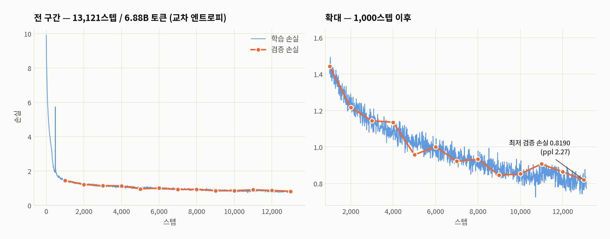
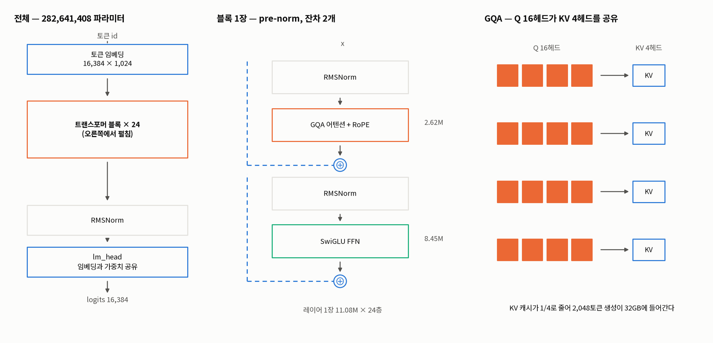
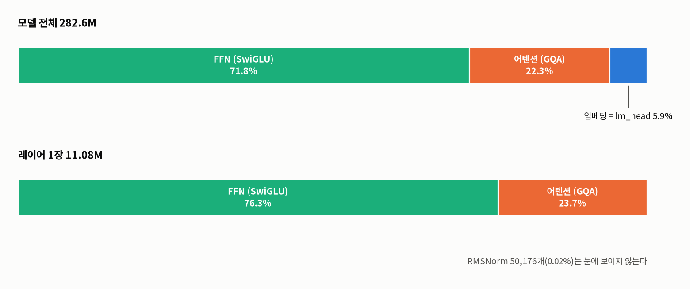
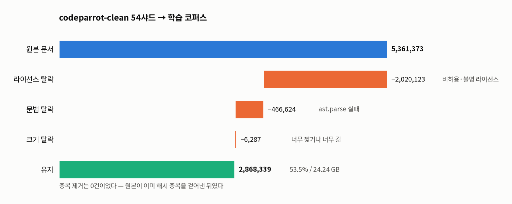
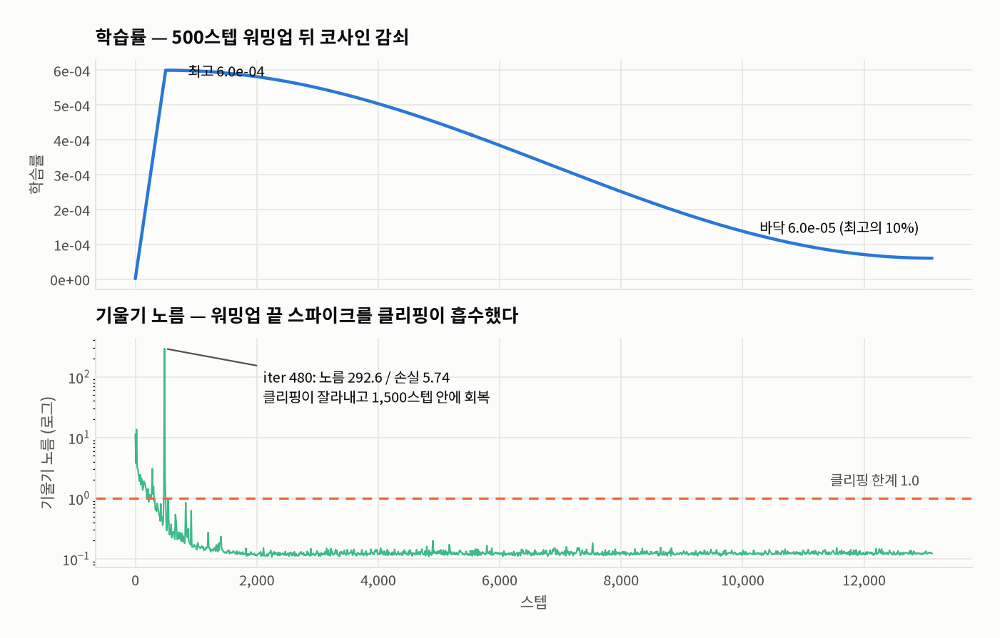
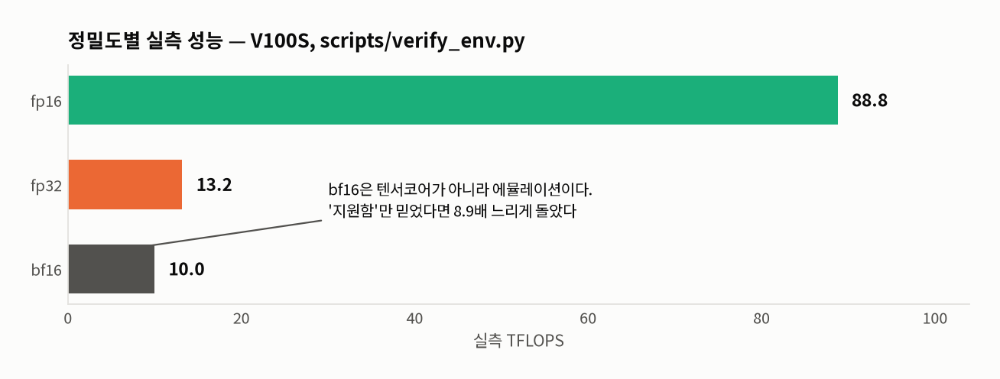
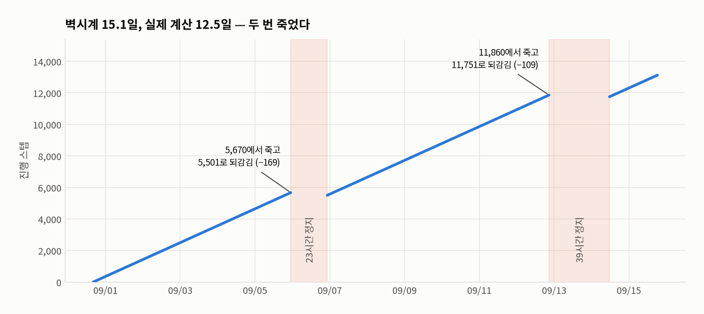
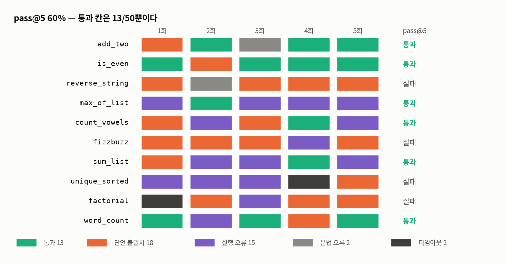

# sangyong_llm

파이썬 코드를 생성하는 **282M 파라미터 트랜스포머**를 밑바닥부터 구현하고,
V100S 한 장으로 **69억 토큰**을 완주시킨 기록이다.

PyTorch에서 빌려 쓰는 것은 텐서 연산 / autograd / CUDA / 융합 어텐션 커널
네 가지뿐이다. 토크나이저, 어텐션, RoPE, RMSNorm, 학습 루프, 데이터
파이프라인, 평가 채점기, 재시작 워치독은 전부 직접 작성했다.
`transformers`, `tokenizers`, `datasets`, `accelerate`, `peft`는 쓰지 않는다.

## 결과

2026-08-31 ~ 2026-09-15, Tesla V100S-PCIE-32GB 한 장.

| 항목 | 값 |
|---|---|
| 파라미터 | **282,641,408** |
| 학습 토큰 | **6,879,527,547** (1에포크, 13,121스텝) |
| 최종 학습 손실 | 0.7711 (iter 13,120) |
| **최저 검증 손실** | **0.8190** (iter 13,000) |
| 검증 퍼플렉시티 | **2.268** |
| 문법 유효율 | **96.0%** (48/50) |
| **pass@5** | **60.0%** (6/10) |
| 샘플 단위 통과율 | 26.0% (13/50) |
| 처리량 | 6,513 tok/s (80.9초/스텝) |
| 피크 VRAM | 25.01 GB / 32 GB |
| 벽시계 | 15.1일 (실제 계산 12.5일) |

평가 수치는 `best.pt`(iter 13,000) 기준이다. 문제가 10개뿐이라 pass@5는
잡음이 크다 — [이 pass@5를 믿지 말 것](#이-pass5를-믿지-말-것) 참고.

<picture>
  <source media="(prefers-color-scheme: dark)" srcset="docs/assets/training-curve-dark.png">
  
</picture>

검증 손실은 13,000스텝까지 단조롭게 떨어졌고 과적합으로 꺾이지 않았다.
1에포크를 채워서 끝난 것이지 수렴해서 끝난 것이 아니다. 데이터를 더 넣으면
더 내려갈 자리가 남아 있다.

곡선이 iter 4,000·11,000 근처에서 잠깐 되튀는 것은 실제 성능 변화가 아니라
**검증 배치 샘플링에 시드를 안 박아서 생긴 잡음**이다. 평가마다 다른 배치를
뽑는다. SFT를 시작하기 전에 고정해야 한다.

## 무엇을 직접 만들었나

| 만든 것 | 빌린 것 |
|---|---|
| 바이트 단위 BPE (학습·인코딩·디코딩·직렬화) | `torch.Tensor`, autograd |
| RoPE, RMSNorm, GQA 어텐션, SwiGLU | CUDA 런타임 |
| KV 캐시 증분 생성 | `F.scaled_dot_product_attention` (융합 커널) |
| 데이터 필터·중복 제거·토큰화 파이프라인 | `torch.optim.AdamW`, `GradScaler` |
| 학습 루프(기울기 누적·체크포인트·재개) | |
| 정밀도 선택(실측 TFLOPS 기반) | |
| 평가 채점기(문법·pass@k·격리 실행) | |
| SFT 데이터셋·손실 마스킹·튜닝 루프 | |
| 검색 툴 호출 프로토콜·파이프라인 | |
| 분리 실행 런처·재시작 워치독 | |

코드 5,119줄 + 테스트 3,481줄.

## 모델

```
             282m                         53m
d_model      1024                         640
layers       24                           10
heads        16 (KV 4, GQA 4:1)           10 (KV 2, GQA 5:1)
d_ff         2752 (SwiGLU)                1728 (SwiGLU)
context      2048                         1024
파라미터      282,641,408                  53,507,200
기준 HW      V100S 32GB                   RTX 4050 Laptop 6GB
```

<picture>
  <source media="(prefers-color-scheme: dark)" srcset="docs/assets/architecture-dark.png">
  
</picture>

- **위치 인코딩**: RoPE. 학습 가능한 위치 임베딩이 없다. q와 k를 위치에 따라
  회전시키면 두 벡터의 내적에 **상대 거리**가 자연히 들어간다. 위치마다
  파라미터를 두지 않으므로 학습할 것이 없고, 학습 때 본 적 없는 길이에도
  정의는 된다(잘 동작한다는 보장은 별개다).
- **정규화**: RMSNorm (pre-norm). LayerNorm과 달리 평균을 빼지 않고 제곱평균
  제곱근으로만 나눈다. pre-norm이라 잔차 경로가 항등 함수로 남아, 24층을
  쌓아도 초기 신호가 감쇠하지 않는다.
- **어텐션**: GQA. Q 16헤드가 KV 4헤드를 4:1로 공유한다. head_dim은
  1024/16 = 64다. 2,048토큰 한 줄을 생성할 때 KV 캐시가 fp16 기준
  **48 MB** — 같은 크기를 MHA로 짰다면 192 MB다.
- **FFN**: SwiGLU. `w_down(silu(w_gate(x)) * w_up(x))`, bias 없음. 게이트
  때문에 행렬이 2개가 아니라 3개다. `d_ff` 2,752는 임의로 고른 값이 아니라
  `4 × d_model`에 2/3를 곱해 행렬 3개의 파라미터를 2개일 때와 맞추고
  (4096 × 2/3 ≈ 2731) 64의 배수로 올린 값이다. 53m의 1,728도 같은 규칙에서
  나온다(2560 × 2/3 ≈ 1707 → 1728).
- **어휘**: 16,384 — 프리셋이 정하지 않고 항상 `tokenizer/tokenizer.json`에서
  읽는다. 어휘가 바뀌면 임베딩 크기가 달라져 기존 체크포인트가 전부
  무용지물이 되기 때문이다.

`282m`의 크기는 취향이 아니라 계산이다. 6.88B 토큰의 Chinchilla 최적치가
약 330M이고, 같은 데이터를 53M에 쓰면 6배 과잉이라 수익이 크게 체감된다.

### 282.6M이 어디에 있나

<picture>
  <source media="(prefers-color-scheme: dark)" srcset="docs/assets/params-dark.png">
  
</picture>

파라미터를 셀 때 흔히 어텐션을 먼저 떠올리지만, 실제로 무거운 쪽은 **FFN이고
전체의 71.8%**다. 레이어 1장만 보면 더 뚜렷해서 FFN 8.45M 대 어텐션 2.62M,
76% 대 24%다. 게이트가 붙어 행렬이 3개인 데다 각 행렬이 1024 × 2752이기
때문이다.

어텐션이 22.3%로 내려앉은 것은 GQA 덕이다. K와 V를 16헤드가 아니라 4헤드로만
두므로 두 행렬이 1024 × 1024가 아니라 1024 × 256이다. 같은 모델을 MHA로 짰다면
레이어마다 1.57M씩, 전체로 **37.7M이 더 붙는다.** GQA는 KV 캐시를 줄이려고
넣은 것인데 파라미터도 같이 줄었다.

임베딩이 5.9%뿐인 것은 어휘가 16,384로 작고 `lm_head`가 임베딩과 **같은
텐서를 쓰기** 때문이다(`tie_embeddings`). 묶지 않았다면 16.8M이 더 붙는다.
RMSNorm은 50,176개로 전체의 0.02%라 그림에서 보이지도 않는다.

이 수치는 옮겨 적은 것이 아니라 `model.Transformer`를 실제로 만들어 센 값이고,
합이 282,641,408로 위 표와 맞는다.

## 데이터

`codeparrot/codeparrot-clean` 54샤드(12.2 GB 압축)에서 출발한다.

<picture>
  <source media="(prefers-color-scheme: dark)" srcset="docs/assets/data-funnel-dark.png">
  
</picture>

문법으로 떨어진 46만 건은 `ast.parse`가 실패한 것들이다. 파이썬 2 문법과
잘린 파일이 여기 들어간다. 크기 탈락 6,287건은 전체의 0.1%라 그림에서 선
하나로 보인다.

중복 제거가 **0건**인 것은 파이프라인이 안 돈 게 아니라 `codeparrot-clean`이
이미 해시 중복을 걷어낸 데이터셋이기 때문이다. 그래도 단계를 남겨 둔 것은
다른 코퍼스를 붙일 때 필요하기 때문이다.

토큰화하면 **train 6,879,527,547 / val 13,756,746 토큰**이다
(`train.bin` 13.1 GB, `val.bin` 26.2 MB, uint16 평면 배열).

토크나이저는 바이트 단위 BPE, 병합 16,127개 + 특수 토큰 1개 = 어휘 16,384.
압축률 3.763 바이트/토큰. 96코어에서 92워커로 병렬 토큰화했다.

라이선스 탈락이 전체의 38%로 가장 크다. 데이터가 모자라서가 아니라 쓸 수
있는 것만 쓰겠다는 판단이고, 그 대가로 원본의 절반을 버렸다.

## 학습

```bash
python scripts/train_watchdog.py start --model 282m --batch-size 2 --grad-accum 128
```

| 항목 | 값 | 근거 |
|---|---|---|
| 정밀도 | fp16 + GradScaler | V100은 sm_70. bf16 텐서코어가 없다 |
| 옵티마이저 | AdamW (0.9, 0.95) | |
| weight decay | 0.1 | 노름·바이어스는 제외 |
| 학습률 | 6e-4 | 500스텝 워밍업 → 코사인 → 6e-5 |
| 기울기 클리핑 | 1.0 | `scaler.unscale_()` **뒤에** 적용 |
| 배치 | 2 × 누적 128 × 2048 = **524,288 토큰/스텝** | 32GB에서 역산 |
| 스텝 | 13,121 (1에포크) | `train.bin` 크기에서 자동 계산 |
| 평가 주기 | 1,000스텝 | |

<picture>
  <source media="(prefers-color-scheme: dark)" srcset="docs/assets/lr-gnorm-dark.png">
  
</picture>

기울기 노름은 워밍업이 끝나는 iter 480에서 **292.6**까지 튀었고 손실도 5.74로
같이 튀었다. 클리핑 한계 1.0이 이걸 잘라냈고 1,500스텝 안에 0.13 근방으로
돌아와 끝까지 평평했다. 전 구간에서 **fp16 스케일러가 건너뛴 스텝은 0회**다.

### fp16을 고른 이유

`torch.cuda.is_bf16_supported()`는 V100에서도 `True`를 반환한다. 그 bf16은
텐서코어가 아니라 에뮬레이션이라 fp32보다도 느리다.

<picture>
  <source media="(prefers-color-scheme: dark)" srcset="docs/assets/precision-dark.png">
  
</picture>

그래서 `scripts/verify_env.py`는 "지원하는가"가 아니라 **"실측 TFLOPS가
fp32보다 빠른가"**를 판정 근거로 쓴다. 지원 여부만 믿었다면 8.9배 느리게
돌았을 것이다.

fp16을 쓰면 클리핑 순서가 걸린다. `scaler.unscale_()` **전에** 클리핑하면
스케일된 기울기를 1.0으로 자르고 그 뒤 다시 나누게 되어, 유효 학습률이
스케일 배수만큼 조용히 무너진다. 손실 곡선은 멀쩡해 보인다.

## 16일 동안 무슨 일이 있었나

학습은 **두 번 죽었다.** 둘 다 트레이스백을 남기지 않았다.

<picture>
  <source media="(prefers-color-scheme: dark)" srcset="docs/assets/timeline-dark.png">
  
</picture>

| | 죽은 시각 | 죽은 지점 | 재개 지점 | 되감김 | 멈춰 있던 시간 |
|---|---|---|---|---|---|
| 1차 | 09-05 22:57 | iter 5,670 | 5,501 | −169 | 23.4시간 |
| 2차 | 09-12 20:45 | iter 11,860 | 11,751 | −109 | 38.8시간 |

1차는 트레이스백도 OOM도 재부팅 흔적도 없었다. `/var/log` 접근 권한이 없어
규명하지 못했다. 원인을 모르니 **재발을 전제로** `scripts/train_watchdog.py`를
만들고 재개할 때 붙였다. 5분마다 보고, 프로세스가 사라졌거나 로그가 45분째
안 늘면 `--resume`으로 다시 띄운다. 재시작하지 **않는** 경우가 셋 있다.

- 로그에 정상 종료 문구가 있을 때
- 15분 안에 죽기를 3회 반복할 때 (설정 문제로 보고 손을 뗀다)
- `stop` 요청이 있을 때 (사람이 일부러 멈춘 학습을 되살리면 안 된다)

**2차에서 그 워치독이 무력화됐다.** 학습이 20:45에 죽었는데, 2분 뒤인
20:47에 워치독 자신이 SIGTERM을 받고 "중단 요청"으로 정상 종료했다. 서버는
재부팅되지 않았고(199일 가동) 메모리도 여유가 있었다. 외부에서 사용자
프로세스를 일괄 종료한 것으로 보인다. 학습과 감시자가 같은 신호에 함께
쓸려나가면 감시자를 하나 더 두는 것으로는 못 막는다 — 38.8시간을 잃었다.

되감김이 생기는 것은 체크포인트를 1,000스텝마다 쓰기 때문이다. 두 번 합쳐
**278스텝을 다시 계산**했다. 벽시계 15.1일 중 실제 계산은 12.5일이고,
나머지 2.6일은 죽은 채로 서 있었다.

**함정 하나.** 학습은 워치독의 자식 프로세스인데 워치독은 `wait()`을 하지
않는다. `os.kill(pid, 0)`은 좀비에도 성공하므로, PID 확인만 하면 죽은 학습이
영원히 "실행 중"으로 보여 워치독이 무력화된다. `_alive()`가
`/proc/<pid>/stat`의 상태 문자까지 본다.

## 평가

```bash
python eval/harness.py --ckpt checkpoints/best.pt --k 5
```

문제 10개를 각각 5번 생성해 별도 프로세스에서 실행하고 채점한다.

| | |
|---|---|
| 문법 유효율 | **96.0%** (48/50) |
| pass@5 | **60.0%** (6/10) |
| 샘플 단위 통과율 | 26.0% (13/50) |

<picture>
  <source media="(prefers-color-scheme: dark)" srcset="docs/assets/eval-grid-dark.png">
  
</picture>

칸 하나가 생성 한 번이다. 통과는 **50칸 중 13칸**뿐인데 pass@5는 60%가 된다 —
5번 중 한 번만 맞으면 그 문제는 통과로 세기 때문이다. `max_of_list`는 5번 중
4번이 실행 오류인데 통과로 잡혔고, `sum_list`도 마찬가지다. **pass@5는 모델이
얼마나 자주 맞히는지가 아니라 몇 번 시켜보면 한 번은 맞히는지를 재는 값**이다.

50회 중 실패 사유: 단언 불일치 18, 실행 오류 15, 문법 오류 2, 타임아웃 2.

**문법은 거의 다 맞고 의미가 자주 틀린다.** 파이썬의 형태는 배웠지만
"무엇을 계산하라고 했는지"는 절반쯤만 따라온다. 282M / 6.9B 토큰에서 나올
만한 자리다.

### 이 pass@5를 믿지 말 것

`latest.pt`(iter 13,120)로 같은 평가를 돌리면 이렇게 나온다.

| 체크포인트 | 스텝 | 문법 유효율 | pass@5 | 샘플 단위 |
|---|---|---|---|---|
| `best.pt` | 13,000 | 96.0% | **60.0%** | 26.0% (13/50) |
| `latest.pt` | 13,120 | 98.0% | **50.0%** | 28.0% (14/50) |

**121스텝 차이인데 pass@5가 10%p 벌어진다.** 문제가 10개뿐이라 한 문제가
10%p다. 반면 샘플 단위 통과율은 26% 대 28%로 거의 같다 — 이쪽이 실제
차이에 가깝고, pass@5의 10%p는 대부분 표본이 작아서 생긴 잡음이다.

같은 문제가 학습 중 검증 평가에도 있다. `estimate_loss`가 시드 없이
val에서 매번 다른 창 100개(전체의 1.5%)만 뽑는다. 실측 표준편차 0.034,
최소~최대 폭 0.097이라 손실 곡선의 되튐은 대부분 이걸로 설명된다.
**따라서 `best.pt`가 실제로 최선이라는 보장이 없다.** 이 런에서는 마지막
평가(iter 13,000)가 best를 가져가 `latest.pt`와 121스텝 차이로 붙어
결과적으로 문제가 없었지만, 운이 좋았던 것이지 코드가 고쳐진 게 아니다.
**쓸 모델은 `latest.pt`다.**

고치려면 평가에 고정 시드 generator를 넘기고 `eval_iters`를 올린다.
재개 시 체크포인트의 `best_val`은 옛 척도로 잰 값이라 같이 리셋해야 한다.

채점기는 종료코드만 보지 않는다. 생성 코드가 `sys.exit(0)`을 부르면 테스트를
건너뛰고 0을 반환하므로 센티넬 출력을 확인한다.

### 실제 생성

```bash
python train/sample.py --ckpt checkpoints/best.pt \
  --prompt 'def flatten(nested):
    """Flatten a nested list into a single flat list."""
' --temperature 0.6
```

```python
def flatten(nested):
    """Flatten a nested list into a single flat list."""
    return [item for sublist in nested for item in sublist]


def flatten_entities(entities):
    """Flatten a list of entities into a single flat list."""
    return [entity for entity in entities if entity]


def flatten_list_of_dicts(list_of_dicts):
    """Flatten a list of dicts into a single flat list."""
    return [dict(zip(flatten_entities(list_of_dicts[0]), ...
```

첫 함수는 맞다. 그다음부터가 이 모델의 전형적인 실패 방식이다 — 멈추지 않고
**비슷한 이름의 함수를 계속 찍어낸다.** 프리트레이닝만 한 기반 모델이라
"요청을 하나 끝내고 멈춘다"를 배운 적이 없다. SFT가 필요한 지점이 여기다.

한국어 프롬프트는 잘 못 따라온다. 코퍼스가 영어 파이썬 코드라 당연한 결과다.

## 검증

```bash
python scripts/run_tests.py
```

**9개 스위트 157항목 전부 통과.**

| 스위트 | 항목 | 무엇을 잡는가 |
|---|---|---|
| `verify_env.py` | 9 | GPU 행렬곱 정확도, 정밀도 실측 TFLOPS, GQA SDPA, 가용 VRAM |
| `test_tokenizer.py` | 13 | 적대적 입력 28종, 무작위 유니코드 1000건, 어휘 크기 불변 |
| `test_model.py` | 16 | 인과 마스크 누설, RoPE 상대위치, KV 캐시 등가, 프리셋 크기 고정 |
| `test_training.py` | 10 | 기울기 누적 등가, 단일배치 과적합, 재개 궤적, fp16 클리핑 순서 |
| `test_eval.py` | 12 | 정답/오답 판별, `sys.exit(0)` 우회 차단 |
| `test_sft.py` | 23 | 손실 마스킹 경계, 어휘 불변, 평가가 에포크를 갉아먹는지 |
| `test_tools.py` | 48 | 파서 경계, 검색 오류 구분, 마커 위조, 컨텍스트 예산 |
| `test_regress_correctness.py` | 7 | 적대적 검증에서 재현된 결함 7종의 회귀 고정 |
| `test_watchdog.py` | 19 | 좀비 판정, 조기사망 차단, 정상 종료 인식, 재시작 인자 일치 |

테스트의 목적은 "동작하는지" 확인이 아니라 **"어떻게 깨지는지" 찾는 것**이다.

특히 **인과 마스크 누설**은 손실 곡선만 봐서는 절대 못 잡는다. 뚫려 있으면
손실은 예쁘게 떨어지고 생성만 안 된다. 재개 궤적도 마찬가지다 — 재개 전후
손실 차이가 0.00e+00임을 테스트로 고정해 뒀다.

## 체크포인트

git에 없다. 학습 결과물이고 개당 3.4 GB다.

| 파일 | 크기 | 용도 |
|---|---|---|
| `best.pt` | 3.39 GB | 검증 손실 최저 지점(iter 13,000). 가중치 + AdamW 상태 + 스텝 |
| `latest.pt` | 3.39 GB | 마지막 지점(iter 13,120). `--resume`이 읽는다. **쓸 모델은 이쪽** |
| `sangyong_llm_282m_iter13120.pt` | 1.13 GB | 추론 전용 가중치 |
| `trainlog.jsonl` | 157 KB | 스텝별 손실·lr·기울기 노름 (**git에 있다**) |
| `train_stdout.log` | 113 KB | 학습 표준출력 전문 (**git에 있다**) |
| `watchdog.log` | 2.3 KB | 워치독 재시작 기록 (**git에 있다**) |

체크포인트의 3분의 2는 AdamW의 `exp_avg` / `exp_avg_sq`다. 학습을 이어서
하려면 필요하지만 추론에는 쓸모가 없다. 떼어내면 3분의 1로 줄어든다.

```bash
python scripts/export_weights.py --ckpt checkpoints/latest.pt          # 3.4GB -> 1.1GB
python scripts/export_weights.py --ckpt checkpoints/latest.pt --half   # 1.1GB -> 0.6GB
```

`--half`로 만든 파일로는 학습을 이어서 할 수 없다.

그래프를 다시 그리려면 (`matplotlib`은 문서용이고 학습·추론 의존성이 아니다):

```bash
uv pip install matplotlib
python scripts/plot_training.py --font NotoSansKR-Regular.ttf NotoSansKR-Bold.ttf
```

## 재현

Python 3.12 venv + PyTorch cu124. Python 3.14에는 CUDA 휠이 없다.

```bash
uv venv --python 3.12 .venv
uv pip install torch numpy pyarrow huggingface_hub --index-url https://download.pytorch.org/whl/cu124
```

전체 검증부터 돌린다. 통과하지 않으면 다음으로 넘어가지 않는다.

```bash
.venv/bin/python scripts/run_tests.py
```

데이터를 준비한다. 54샤드면 약 6.9B 토큰이다. `filter`는 이미 처리한 샤드를
건너뛰므로 나눠서 받아도 된다.

```bash
.venv/bin/python data/download.py --shards 54
.venv/bin/python data/prepare.py filter
.venv/bin/python data/prepare.py tokenize
```

토크나이저는 **다시 학습하지 않는다.** `tokenizer/tokenizer.json`이 저장소에
들어 있고, 이걸 바꾸면 어휘 크기가 달라져 체크포인트가 전부 무용지물이 된다.

며칠 걸리는 작업이므로 터미널·세션과 분리해서, 워치독을 통해 띄운다.

```bash
.venv/bin/python scripts/train_watchdog.py start --model 282m --batch-size 2 --grad-accum 128
.venv/bin/python scripts/train_watchdog.py status
.venv/bin/python scripts/train_detached.py stop     # 워치독 먼저, 그다음 학습
```

`stop`의 순서가 반대면 워치독이 방금 멈춘 학습을 되살린다.

## 아직 안 한 것

- **SFT를 안 돌렸다.** 기반 모델은 이제 나왔다(`checkpoints/best.pt`).
  데이터셋 2,845/155쌍과 학습 루프는 준비됐고 CPU 초소형 모델로만 검증한
  상태다. 위의 생성 예시가 보여주듯 "멈추는 법"을 가르치는 게 다음 순서다.
- **검증 배치 시드를 안 박았다.** 손실 곡선의 되튐이 이것 때문이다.
  SFT 전에 고쳐야 비교가 가능하다.
- **검색/툴 레이어는 실제 키로 안 돌렸다.** 파서와 파이프라인은 48항목으로
  검증했지만 실제 검색은 `BRAVE_SEARCH_API_KEY` 등이 있어야 나간다.

## 한계

- **1에포크로 끝났다.** 검증 손실이 아직 내려가는 중이었다. 수렴이 아니라
  데이터 소진이다.
- **의미 정확도가 낮다.** 문법 96%에 pass@5 60%, 샘플 단위로는 26%다.
  282M에 6.9B 토큰이면 여기까지다.
- GPU 한 장만 썼다. 서버에 V100S가 10장 있지만 3번 한 장만 쓰기로 약속한
  공용 장비다(`~/.profile`의 `CUDA_VISIBLE_DEVICES=3`로 강제). DDP를 붙일
  자리가 아니라 12.5일이 걸렸다. DDP 코드 자체는 `ddp-l40s` 브랜치에 있는데,
  L40S 3장을 전제로 짰고 bf16이 코드에 박혀 있어 이 V100S에서는 쓸 수 없다.
  실제 하드웨어에서 돌려본 적도 없다.
- 평가 격리는 별도 프로세스 + 타임아웃 수준이다. 컨테이너나 seccomp를 쓴
  진짜 샌드박스는 아니다.
- 툴 호출 마커가 한국어라 이 토크나이저에서 9~15토큰을 먹는다. 같은 뜻의
  ASCII 마커는 4~5토큰이다. SFT 시작 전이면 바꾸는 편이 컨텍스트 예산에
  유리하다 (`tools/protocol.py` 상수 세 줄).

## 저장소

| 경로 | 역할 |
|---|---|
| `tokenizer/bpe.py` | 바이트 단위 BPE. 학습/인코딩/디코딩/저장 |
| `model/transformer.py` | RoPE, RMSNorm, GQA 어텐션, SwiGLU, KV 캐시 생성 |
| `model/precision.py` | GPU 세대로 bf16/fp16 선택. `is_bf16_supported()`를 안 믿는다 |
| `data/download.py` | codeparrot-clean 샤드 다운로드 |
| `data/prepare.py` | 필터 → 토크나이저 학습 → 토큰화 (3단계) |
| `train/train.py` | 프리트레이닝 루프 (기울기 누적, 체크포인트, 재개) |
| `train/sample.py` | 학습된 모델로 코드 생성 |
| `eval/harness.py` | 문법 유효율 + pass@k 채점 |
| `eval/problems.py` | 채점 문제 10종 |
| `finetune/make_dataset.py` | 코퍼스에서 (독스트링 → 함수) 지시-응답 쌍 추출 |
| `finetune/format.py` | `### 지시:` / `### 코드:` 프롬프트 포맷 |
| `finetune/dataset.py` | SFT 데이터셋. 프롬프트 구간 손실 마스킹 |
| `finetune/sft.py` | 인스트럭션 튜닝 루프 (프리트레이닝 lr의 1/10) |
| `tools/protocol.py` | `### 검색:` 툴 호출 파싱, 검색 결과 컨텍스트 포맷 |
| `tools/search.py` | Brave / Tavily / Serper 클라이언트 |
| `tools/pipeline.py` | 생성 → 툴 호출 → 검색 → 재주입 루프 |
| `scripts/verify_env.py` | GPU/CUDA 환경 검증 |
| `scripts/probe_vram.py` | 안전한 batch_size 실측 |
| `scripts/train_detached.py` | 학습을 세션과 분리해 실행 / 상태 / 중단 |
| `scripts/train_watchdog.py` | 죽거나 멈춘 학습을 다시 띄운다 |
| `scripts/export_weights.py` | 체크포인트에서 추론 가중치만 추출 |
| `scripts/plot_training.py` | 학습 로그로 README 그래프 생성 |
| `scripts/run_tests.py` | 9개 스위트 일괄 실행 |

설계 근거와 시행착오는
[docs/design/2026-08-13-sangyong-llm-design.md](docs/design/2026-08-13-sangyong-llm-design.md),
서버 구성은 [docs/SERVER_SETUP.md](docs/SERVER_SETUP.md),
작업 규칙은 [CLAUDE.md](CLAUDE.md)에 있다.

## 라이선스

MIT. 학습 데이터는 `codeparrot/codeparrot-clean`에서 허용 라이선스 문서만
걸러 썼다.
